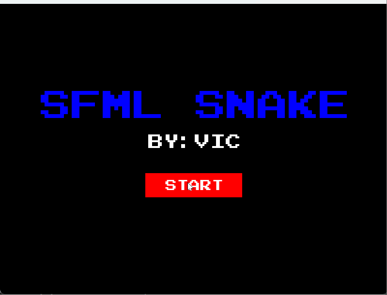

<!--
 * @Author: vic123 zhangzc_efz@163.com
 * @Date: 2024-05-27 22:12:03
 * @LastEditors: vic123 zhangzc_efz@163.com
 * @LastEditTime: 2024-06-15 20:20:10
 * @FilePath: \SFML-snake\README.md
 * @Description:
 *
 * Copyright (c) 2024 by vic123, All Rights Reserved.
-->

# SFML SNAKE

PJ for OOP at Fudan University

DEMO：https://www.bilibili.com/video/BV1D3Vee6EoB

## 玩法：

两种操控模式：长按鼠标右键控制蛇头 或 wasd 控制蛇头

空格加速，吃彩色点点增长/大躯体，人机的蛇头撞到你的蛇身完成击杀（是有点难的）

## project tree

├─resources //all the resources(img audio) needed by the game

├─docs

│ ├─SFML 学习日志.md //Learning Journal of the SFML Library

│ └─ 项目日志.md //change log

├─src //SOURCE CODE

│ ├─entity

│ ├─screen

│ ├─UI

│ └─utils

├─snake_test.cpp //program entrance

└─CMakeLists.txt

## 编译

验证过的编译器：

1. mingw64 14.2.0
2. mingw64 13.0.1
3. mingw64 8.1.0
4. mingw64 7.2.0

## a couple of things to be imporved

1. Manage snakes and food using an object pool.
2. reimplement window resizing adaptation
3. Add more UI components
4. Discard the dual-layer state machine
5. Develop other snake control strategies
6. use 'vertexarray' for 'snake'(this could significantly reduce computation overhead)
