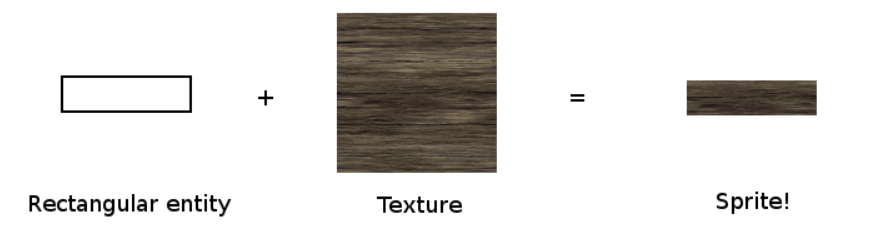

# SFML 学习日志

链接：https://www.sfml-dev.org/tutorials/2.6/

## System

### time

```C++
sf::Clock clock;
while (window.isOpen())
{
    sf::Time elapsed = clock.restart();
    updateGame(elapsed);
    ...
}
```

### thread

SFML thread exists only for a historic reason. Use std::thread instead if your compiler support it.

### user data stream

Used for loading resources from unusual places like network/compressed archive. I don't think I will use it.

## Window

### opening and managing a SFML window

#### construct

_create upon construction:_

`sf::Window window(sf::VideoMode(800, 600), "My window");`

first parameter: the size of the window

second:the title

third(optional): style(fullscreen/have close button/have titlebar...)

fourth(optional): for OpenGL, Idon't think I will go down that deep...

_create after construction:_

```
sf::Window window;
window.create(sf::VideoMode(800, 600), "My window");
```

parameter: same

#### the big while loop for everyone

```C++
#include <SFML/Window.hpp>

int main()
{
    sf::Window window(sf::VideoMode(800, 600), "My window");

    // run the program as long as the window is open
    while (window.isOpen())
    {
        // check all the window's events that were triggered since the last iteration of the loop
        sf::Event event;
        while (window.pollEvent(event))
        {
            // "close requested" event: we close the window
            if (event.type == sf::Event::Closed)
                window.close();
        }
    }

    return 0;
}
```

#### vertical Sync

`window.setFramerateLimit(60); // call it once, after creating the window`
`window.setVerticalSyncEnabled(true); // call it once, after creating the window`

#### API doc

https://www.sfml-dev.org/documentation/2.6.0/classsf_1_1Window.php

#### Warning!

the event loop and the creation of the window must be in the same thread.
Good practise would be to do event handling in the main thread and move the rest to other thread.

bigger window than the desk size would behave incorrectly

### what is event

event is a union, and should be handled according to ist current type.
Evnet can only be set by `pollEvent` and `waitEvent`.

#### a typical event loop

```C++
sf::Event event;

// while there are pending events...
while (window.pollEvent(event))
{
    // check the type of the event...
    switch (event.type)
    {
        // window closed
        case sf::Event::Closed:
            window.close();
            break;

        // key pressed
        case sf::Event::KeyPressed:
            ...
            break;

        // we don't process other types of events
        default:
            break;
    }
}
```

#### event type

1. `sf::Event::Closed`
   program should call window.close() upon receiving it
2. `sf::Event::Resized`

   ```C++
    if (event.type == sf::Event::Resized)
    {
        //std::cout << "new width: " << event.size.width << std::endl;
        //std::cout << "new height: " << event.size.height << std::endl;
    }
   ```

3. `sf::Event::LostFocus` and `sf::Event::GainedFocus`

   This event can be used e.g. if you want to pause your game when the window is inactive.

   ```C++
   if (event.type == sf::Event::LostFocus)
       myGame.pause();

   if (event.type == sf::Event::GainedFocus)
       myGame.resume();
   ```

4. `sf::Event::TextEntered`

   catch user input in a text field

   could be used in the leaderboard of my PJ

5. `sf::Event::KeyPressed` and `sf::Event::KeyReleased`

   if a key is held, multiple keypressed events will be triggered at the default operating system delay.

   for smooth action good practice is to set a boolean to true when keypressed and remove it when keyreleased

   use keycode instead of code if physcial locations matters more than the character represented

   ```C++
   if (event.type == sf::Event::KeyPressed)
   {
       if (event.key.scancode == sf::Keyboard::Scan::Escape)
       {
           //std::cout << "the escape key was pressed" << std::endl;
           //std::cout << "scancode: " << event.key.scancode << std::endl;
       }
   }

   ```

### keyboard mouse joystick

query keyboard state while event tells you when a key is pressed

skipped

## Graphics

### drawing 2d

to draw, use the class renderWindow derived from base class window. It keeps all the window function but adds fucntions for drawing.

1. `window.clear(sf::Color::Black)`
   clear the window with the color parmeter. Display when window.display is called

2. `window.draw()`

3. `window.display()`
   copy everything in the buffer and really display rhem on the screen

### GOOD PRACTISE

do clear/draw/display cycle to refresh everything at each iteration of the main loop

#### Sprite

Sprite = entity + texture

_texture_

```C++
sf::Texture texture;
// load a 32x32 rectangle that starts at (10, 10)
if (!texture.loadFromFile("image.png", sf::IntRect(10, 10, 32, 32)))
{
    // error...
}
```

#### Text

#### Shape
