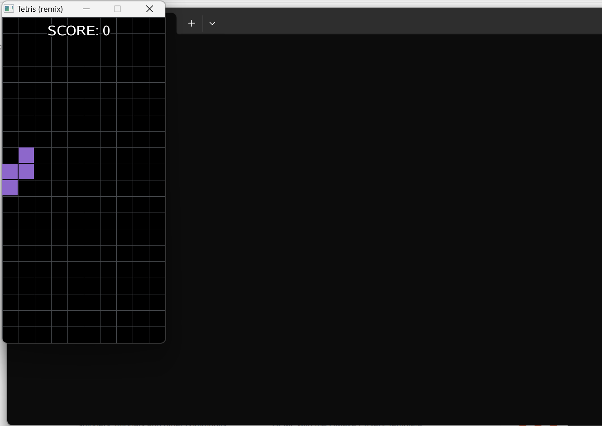
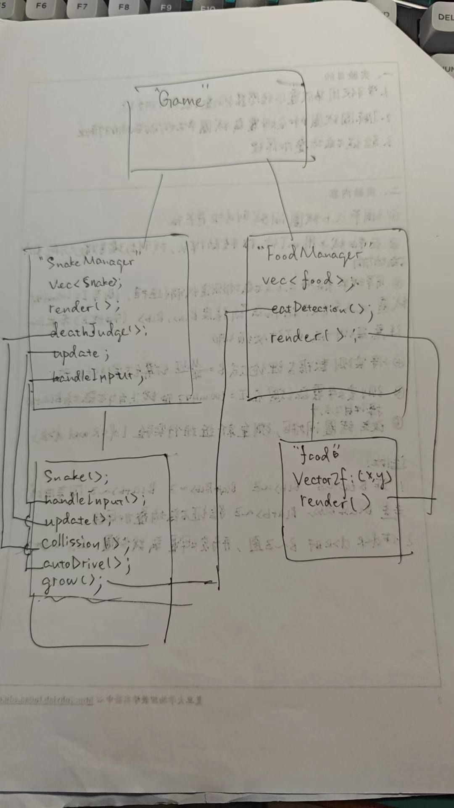
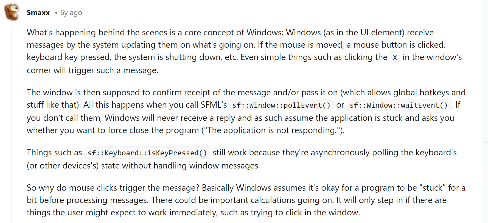
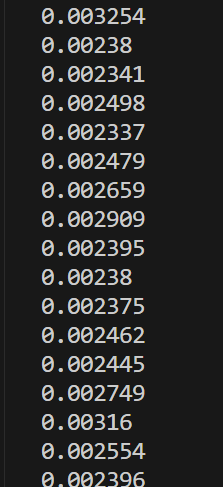
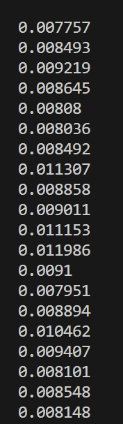

<!--
 * @Author: vic123 zhangzc_efz@163.com
 * @Date: 2024-05-27 21:43:30
 * @LastEditors: vic123 zhangzc_efz@163.com
 * @LastEditTime: 2024-06-02 10:28:35
 * @FilePath: \SFML-snake\docs\项目日志.md
 * @Description:
 *
 * Copyright (c) 2024 by vic123, All Rights Reserved.
-->

## 2024-5-27

## 配置 SFML

### 使用 cmake-sfml template：

下载：`git clone https://github.com/SFML/cmake-sfml-project.git`

配置：使用 vscode cmake 插件一键 build

该命令会执行本项目目录下的 cmakelists，下载 sfml 项目仓库，并根据 sfml 项目中包含的 cmakelists 对 sfml 进行编译。以后，如果我们在本项目中写的源文件有 include <SFML/...>，在编译时就直接把编译好的 sfml 组件给静态链接进来。

验证：
cmake-sfml template 自带一个例子程序 main.cpp。用 cmake 编译 main 之后，执行 main.exe，显示一个黑色窗口，说明 sfml 已经被配置好了。

### 调通别人的俄罗斯方块

下载：`git clone https://github.com/terroo/tetris`

把源文件挪到 cmake-sfml-project/src 下，resources 挪到 cmake-sfml-project 下。

在 cmakelists 里加入：`add_executable(main src/main.cpp src/tetris.cpp)`

编译运行，工作正常：

## 2024-5-29

### 设计

### feature：wasd、鼠标控制

现在可以使用 wasd/鼠标控制贪吃蛇

### feature:多蛇

### feature:碰撞检测

### 遇到的 bug

程序不调用 pollEvent，鼠标左键导致闪退

原因：https://www.reddit.com/r/sfml/comments/85g1aj/why_is_my_engine_crashing_whenever_i_click_the/

### 有待思考的问题

食物被吃的判断在 foodManager 里做还是 snakeManager 里做？

要不要把 foodManager 写成 snakeManager 的一个成员变量？

食物飞向蛇头的动画怎么实现？

### 可以改进的地方

1. 把 Manager 写成单例模式
2. 蛇的随机外观渲染，随机初始化
3. collision 运算量优化

## 2024-5-30

### todo

突然意识到用 vector 存蛇身效率很低，每次移动的时间复杂度是 O(n)。改成双端队列更合适。
checked

### 将蛇身的数据结构改为 deque

好家伙，把数据类型改完之后，只需要把首元素插入改掉就编译通过了，赞美多态。

### 进展

优化：食物吸引距离从范数改成曼哈顿距离

从食物被吃掉后销毁，隔固定时间创建，改成被吃掉后随机重生

change snakeBody datastruct from vector to deque

food velocity unlink from framerate

蛇身变大变小

### feature

蛇头角速度限制

## 2024-5-31

### feature

蛇身随变长变大

### major update (Screen Management)

加入页面管理系统

页面基类：IScreen

页面管理：ScreenManager

目前的页面：gameScreen pauseScreen

### major update (UIComponent)

UI 基类：IUIComponent

UI 组件：Button

### warning

在不插电的情况下玩了一会儿，出乎意料的卡起来了？这并不合理，游戏里一共只有 7 个 texture，batching 之后 gpu 只需要算 7 次。

破案了，SFML 不直接提供对 draw 的 batching，要用 VertexArray

## 2024-6-5

### major update

1. 将 food 的渲染方式从逐个渲染改成 vertexArray 并行渲染

在食物数量设置为 100 时，效率提高 10 倍左右，预测随食物数量上升，效率提升比例将上升

对比 FMrender（foodManager render 函数用时）修改前后的用时：

修改后 ≈200
.png>)
修改前 ≈2000
.png>)

1. 机器人蛇简单策略

### todo

蛇头的圆心似乎不和 node 重合
